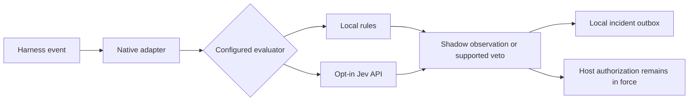

<div align="center">

# JEV Sentinel

**Observe agent boundaries. Evaluate risk. Keep authorization with the host.**

  

[Install](#install) · [Harness coverage](#native-coverage-at-a-glance) · [Python SDK](#other-entry-points) · [Security](SECURITY.md) · [Operations](docs/OPERATIONS.md)

</div>

---

A local, plan-first installer for **OpenClaw, Hermes, OpenCode, Codex, Claude Code,
Pi, Gemini CLI, Cursor, and GitHub Copilot CLI**, with a shared security evaluator.
Python 3.10+ and the target harness's normal runtime are required. No pip/npm
installation, model download, HTTP listener, credential discovery, or paid model
call is performed by Sentinel during installation.

**Status:** executable reference implementation. Native interfaces were checked
against upstream documentation on September 19, 2026. Tests exercise the code,
installer and simulated host contracts; they do not establish deployment success
inside every real harness, Jev detection accuracy, or jailbreak resistance.

## How Sentinel fits



| Start locally | Evaluate deliberately | Inspect the evidence |
| --- | --- | --- |
| Preview installation before writing configuration. | Begin in shadow mode; enable remote evaluation explicitly. | Review local incidents and each adapter's documented coverage. |

## Install

Extract the package and run these commands from its root. `python` below must be
Python 3.10 or later; `python3` or `py -3` may be the appropriate command locally.

```sh
# Preview detected harnesses. This writes nothing.
python install.py

# Install into detected harnesses, initially in local shadow mode.
python install.py --apply

# Explicitly stage every adapter, even where its harness is not installed.
python install.py --targets all --apply

# Select only the originally requested five.
python install.py --targets openclaw,hermes,opencode,codex,claude --apply
```

`all` means all nine implemented adapters, not every agent product or every
account/container on the machine. Missing harnesses are staged, not installed.
No service is started or restarted. Run under the intended harness user; do not
use sudo just to reach more profiles. The standalone `install_jev_sentinel.py`
attachment embeds this same package and accepts the same arguments.

The installed runtime lives at `~/.jev-sentinel/runtime/`; hooks use an absolute
interpreter path and launcher path. The downloaded source can be removed after
installation. Keep the chosen interpreter available. Rerun installation after
moving/removing its Python environment.

### Alternate homes, profiles, and containers

```sh
# Preview two independent Claude profiles and a Codex profile.
python install.py --targets claude,codex \
  --profile claude=/home/agent/profiles/claude-work \
  --profile claude=/home/agent/profiles/claude-personal \
  --profile codex=/home/agent/.codex

# Stage all adapters for a specific container user.
python install.py --home /home/agent --targets all --apply

# Isolate policy, API budget, goals and audit records for one profile.
python install.py --targets claude \
  --profile claude=/home/agent/profiles/claude-work \
  --state-dir /home/agent/.jev-sentinel-work --apply
```

A profile argument is the **configuration root**, not a project repository root.
For example, a project-specific Claude target is `/repo/.claude`, not `/repo`.
OpenCode profile roots get a `plugins/` child; Pi roots get an `extensions/` child.
Default detection honors documented environment roots for several harnesses;
`--home` deliberately ignores those environment overrides. See `docs/ADAPTERS.md`.
Install separately inside each remote machine/container where the agent executes.
A host installation does not protect an unrelated cloud agent or container.

## Activate Jev, then choose enforcement

The initial policy is **`backend=local`, `mode=shadow`**. Local rules are a small
illustrative detector; they are not Jev, do not produce fake probabilities, and
are not a comprehensive prompt-injection defense. Shadow findings are recorded
but do not veto operations. A missing or corrupt policy is treated as a failure,
not permission to silently disable the integration.

```sh
# POSIX shell: supply a key through your normal secret-injection mechanism.
export TYPESAFE_API_KEY='YOUR_KEY'
export JEV_SENTINEL_ALLOW_REMOTE=1
python "$HOME/.jev-sentinel/runtime/launch.py" policy --backend jev

# Inspect configuration only; doctor does not call Jev or prove host activation.
python "$HOME/.jev-sentinel/runtime/launch.py" doctor

# After native trust review, canary checks, and workload evaluation:
python "$HOME/.jev-sentinel/runtime/launch.py" policy --mode enforce
```

PowerShell equivalent:

```powershell
$env:TYPESAFE_API_KEY = 'YOUR_KEY'
$env:JEV_SENTINEL_ALLOW_REMOTE = '1'
python "$HOME/.jev-sentinel/runtime/launch.py" policy --backend jev
python "$HOME/.jev-sentinel/runtime/launch.py" doctor
python "$HOME/.jev-sentinel/runtime/launch.py" policy --mode enforce
```

Variables must be available to the actual harness/plugin process. Restart an
already-running GUI, service, or container with its approved secret mechanism;
a variable set in a different terminal does not update an existing process.
Sentinel never writes an API key into native settings. Selecting Jev without a
key or consent produces REVIEW; in enforce mode, supported pre-tool gates veto.

Remote mode submits selected event text, tool arguments, the configured app
purpose, and an available user-goal snapshot to TypeSafe. Redaction is best-effort,
not a guarantee that proprietary or personal data has been removed. Explicit
consent is required even after redaction. The endpoint is fixed HTTPS, redirects
and environment proxies are disabled, and the model defaults to `jev-1.13.0`.
Changing the model requires re-evaluating thresholds. No accuracy is asserted.

Custom state directory example:

```sh
python /home/agent/.jev-sentinel-work/runtime/launch.py doctor \
  --policy /home/agent/.jev-sentinel-work/policy.json
```

All runtime commands accept `--policy`. Omitting it selects the default home policy.

## Native coverage at a glance

| Harness | Installed entry points | Implemented intervention |
|---|---|---|
| OpenClaw | `before_tool_call`, `after_tool_call` | Pre-tool block; post-tool observation and a subsequent-action latch when the observation completes |
| Hermes | `pre_tool_call`, `post_tool_call` | Pre-tool block; post-tool observation/latch; post-hook return is ignored by Hermes |
| OpenCode | `tool.execute.before`, `tool.execute.after` | Throw to veto a tool; replace returned output, title and metadata on quarantine |
| Codex | `UserPromptSubmit`, `PreToolUse`, `PostToolUse` | Prompt/pre-tool veto; post-tool feedback/latch; no unsupported replacement fields |
| Claude Code | `UserPromptSubmit`, `PreToolUse`, `PostToolUse` | Prompt/pre-tool veto; selective MCP and known-shape Bash result replacement; other results receive feedback/latch |
| Pi | `input`, `tool_call`, `tool_result` | User-input veto, tool veto, result content/details replacement |
| Gemini CLI | `BeforeAgent`, `BeforeTool`, `AfterTool` | Prompt/tool veto; deny can withhold the tool response from model context |
| Cursor | `beforeSubmitPrompt`, `preToolUse`, `postToolUse` | Prompt/tool veto; this adapter implements observation/latch after tools |
| Copilot CLI | `userPromptSubmitted`, `preToolUse`, `postToolUse` | Pre-tool veto; ingress and post-tool hooks are observers in this adapter |

This is the package's implemented coverage, not a claim that each product has no
other capabilities. For example, Cursor offers MCP result replacement, but this
reference adapter does not install that transformation. See `docs/SOURCES.md` for
upstream contracts and `docs/ADAPTERS.md` for exclusions and activation steps.

**Native authorization remains in force.** Claude/Codex receive no explicit
`permissionDecision=allow`. Cursor requires a native allow/deny field; its `allow`
means only no additional hook veto, not a grant bypassing the host's authorization.
REVIEW is mapped to a supported veto, not an invented `ask` response.

## Other entry points

The normalized stdin protocol and the Python SDK provide explicit ingress,
pre-action, tool-output, RAG/context, memory-write, and final-output boundaries
for custom orchestration. Nothing automatically captures all final model output
or all memory writes in every native harness.

```sh
# Process a harmless, deterministic plumbing canary. Inspect JSON, not exit code.
python "$HOME/.jev-sentinel/runtime/launch.py" check < examples/tool-before.json

# Run an offline, disposable RAG quarantine example.
python examples/rag_pipeline.py
```

```python
from jev_sentinel.sdk import Sentinel

guard = Sentinel('/absolute/path/policy.json', harness='my-agent',
                 profile='work', session_id='authenticated-session-id')
guard.user_goal('Compare three suppliers using public information.')
accepted, verdict = guard.external_context(retrieved_text)
if accepted is not None:
    context.append(accepted)

guard.before_tool('catalog.lookup', {'supplier_id': 'A'})
# Then apply your existing authorization and execute the exact authorized call.
```

`check` returns JSON including `decision`, `enforced`, `route`, `reason_codes`,
`probabilities`, and a random incident `id`. Its successful process exit means
protocol success, not that the content is safe. The decision `DEFER` means only
no additional veto. `REVIEW`, `BLOCK`, and `QUARANTINE` are vetoes in enforce mode.
The Python module is provided in the source/runtime tree; vendor it into your app
or import from that trusted location. The installer does not alter global Python
site-packages or PYTHONPATH. The SDK raises `SecurityReviewRequired` for supported gated operations and returns
`None` for a quarantined external context item. `examples/custom_host.py` shows a
restricted review handoff callback; it does not launch a privileged reviewer.

The generic memory entry point deterministically refuses external/agent-origin
memory writes unless the trusted caller declares direct user authorization.
That boolean must come from host authorization, never from a document or LLM.

## Reporting and escalation

Findings enter a bounded, local SQLite incident outbox. Routes are `administrator`
or `security_review`; no administrator email, Slack message, or webhook is sent
automatically and no alternate agent is silently started.

```sh
python "$HOME/.jev-sentinel/runtime/launch.py" outbox --limit 20

# Explicitly deliver queued metadata to an operator-selected HTTPS endpoint.
python "$HOME/.jev-sentinel/runtime/launch.py" dispatch \
  --url https://YOUR-ADMIN-ENDPOINT.example/incidents --allow-network
```

Delivery is at-least-once. Deduplicate `Idempotency-Key` at the receiver. Optional
`JEV_SENTINEL_WEBHOOK_KEY` adds an HMAC-SHA256 signature over the exact request
body. Alerts contain incident metadata and fingerprints, not raw prompts, tool
arguments, repository paths or secrets. Fingerprints are not anonymization.
A separate restricted reviewer may consume that queue, but its output must never
create new permissions or automatically replay a blocked action.

## Verify, inspect, and uninstall

```sh
python -m unittest discover -s tests -v
node --test tests/test_adapters.mjs

# Preview restoration; --apply restores tracked original files.
python install.py --uninstall
python install.py --uninstall --apply
```

The Node tests use mock host callback dispatch and a real Node-to-Python bridge;
they do not launch actual harnesses. Windows command construction is unit-tested;
Windows/macOS native-host execution was not performed in the build environment.
A cross-platform CI recipe is included but has not been run here.

Backups are private files under the state directory, and shared JSON settings are
merged without removing unrelated hooks. Strict JSON is required for automated
shared-file edits. JSON5/JSONC/comments, unexpected schemas, symbolic-link or
junction destinations, and incompatible managed-file edits are refused rather
than rewritten. A refusal does not mean the profile was protected.

Uninstall restores original bytes only after all tracked files pass hash checks;
subsequent user edits cause refusal rather than loss. Operator policy, audit
state and private backups are retained intentionally. Stop the harness before
uninstalling and restart afterwards; already-loaded plugins and native trust
records are outside file rollback. `docs/OPERATIONS.md` covers interrupted installs.

## Security boundaries and remaining work

This is a defense-in-depth **sensor and veto layer**, not a complete reference
monitor. A tool already executed cannot be undone by a post-tool detector. Some
hosted tools, interactive shell input, user shell shortcuts, failed-tool paths,
attachments, subagents, alternate tool protocols, or later plugin rewrites may
bypass a given hook. A host that skips, unloads or times out a hook can defeat its
local fail-closed behavior. Concurrent tool calls may start before a taint latch
is written. No raw image/audio/video scanning is included.

For meaningful adversarial isolation, put the immutable runtime, policy, API key,
and native hook configuration outside the agent's write authority, and use a
separate-identity tool broker plus the host's sandbox/approval controls. A shell
running as the same OS user can otherwise edit or disable this middleware and
read its environment. This installer does not create that OS isolation.

No `/compact` or `/prune` hook, override, replacement, or menu is installed.
See `SECURITY.md`, `docs/OPERATIONS.md`, and `SETUP_PROMPT.md` before enforcement.
